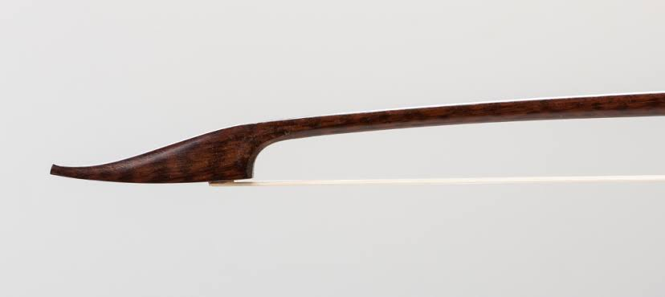

Who knew so many famous composers from Palestrina to Pinocchio to Poulenc wrote pieces for viola da gamba consort exclusively using col legno? Improvise your own grunts and groans while we plink and plunk away on our strings with our bows. No horsehair needed!

## Details

### Where
On a boat in the middle of the Schuylkill.

### When
October 1, 2026

### What to bring
A bow.

### Purchase tickets
Tickets are $500 per player, to be collected by the troll who lives under the bridge.

